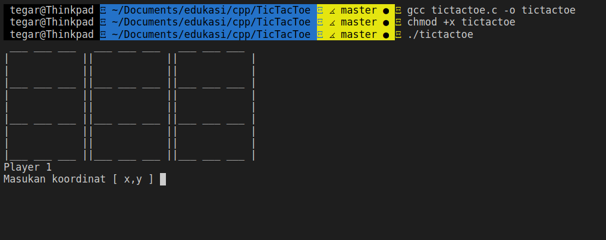
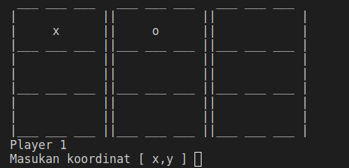

# Two Player TicTacToe in Terminal

Everyone love TicTacToe, we called it Kotak Sembilan in Indonesia.

## How to use

* Compile with gcc `gcc tictactoe.c -o tictactoe`
* Change to executable `chmod +x tictactoe`
* Run `./tictactoe`

